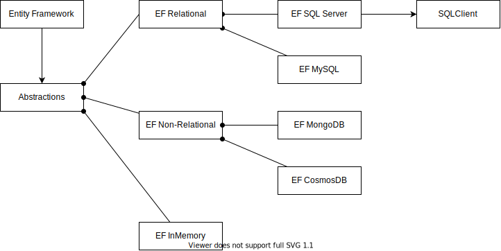

# Entity Framework

https://docs.microsoft.com/en-us/ef/core/

## Features

- Support Relational DB (e.g. MS SQL, MySQL, PostGreSQL, SQLite), Non-Relational DB (e.g. MongoDB, CosmosDB) and In-Memory DB
  - Inversion of Control
  
- Object Relation Mapping (ORM): 
  - Navigation (e.g. One-to-one, One-to-many, Many-to-many)
  - Attribute
  - Linq integration
    - IQueryable / IEnumerable
- Schema Migration: 
  - Database first / Code first
  - Migration Script / Bundle
    - Team environment: https://docs.microsoft.com/en-us/ef/ef6/modeling/code-first/migrations/teams